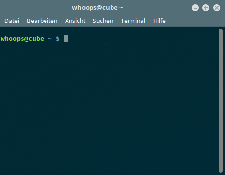

# Control GoPro HERO3+/HERO4 via Console

This repository contains menu-driven scripts for controlling either a GoPro HERO3+ (firmware: 03.02) or GoPro HERO 4 (firmware 4.00) from a GNU/Linux **bash** utilizing **curl** and **sed**.

## Introduction

A picture is worth a thousand words...



## Installation

Copy the script(s) into a folder of your choice.

## Usage

Connect your GNU/Linux machine to the GoPro camera via Wi-Fi and run the desired script.

```bash
./gopro-hero3p-se.sh  # GoPro HERO3+ Silver Edition
./gopro-hero4-se.sh   # GoPro HERO4 Silver Edition
```

## Credits

- Konrad Iturbe -- [GoPro Wifi Hack](https://github.com/KonradIT/goprowifihack)
- Jeremy Cook -- [Pwn Your GoPro: Scripting, WiFi, and Bus Hacking](https://hackaday.com/2014/06/20/pwn-your-gopro-scripting-wifi-and-bus-hacking/)
